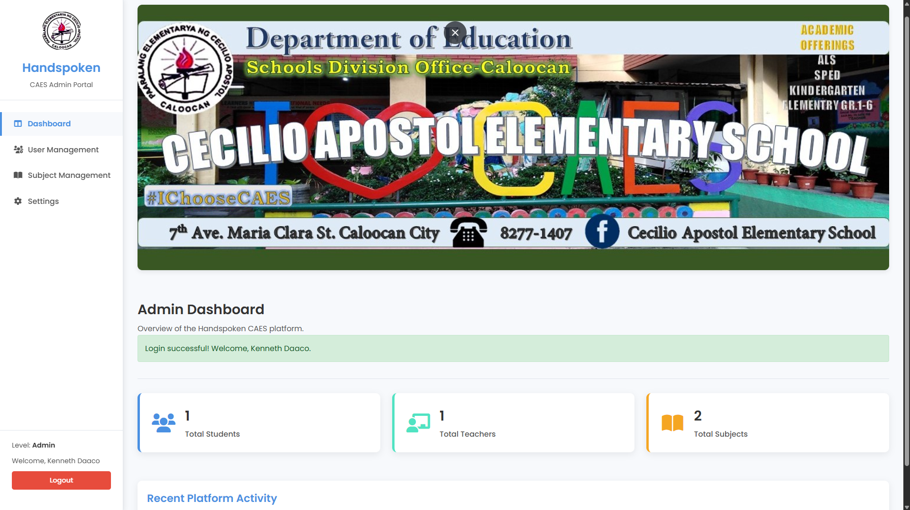

# HandSpoken: An AI-Powered E-Learning Platform with Hand Recognition to Enhance Sign Language Education of Beginner-Level Deaf Students at Cecilio Apostol Elementary School

Welcome to HandSpoken! This project aims to address the gap in digital learning resources for beginner-level deaf students, specifically at **Cecilio Apostol Elementary School**. We are developing an AI-powered e-learning platform to make Filipino Sign Language (FSL) education more accessible, engaging, and effective.

Our system seeks to provide a tool that students can use both in the classroom and at home to practice and reinforce their FSL skills independently, receiving immediate feedback through real-time hand recognition technology.

## Table of Contents
- [Project Goals and Motivation](#project-goals-and-motivation)
- [How Our System Works: The Technical Details](#how-our-system-works-the-technical-details)
- [Application Structure and User Roles](#application-structure-and-user-roles)
  - [Student Role](#student-role)
  - [Teacher Role](#teacher-role)
  - [Admin Role](#admin-role)
- [Student Learning Experience: How Students Train with HandSpoken](#student-learning-experience-how-students-train-with-handspoken)
- [Our Training Process for the AI (Simplified)](#our-training-process-for-the-ai-simplified)
- [Current Focus and Progress](#current-focus-and-progress)

## Project Goals and Motivation

The Philippine education system has made strides in digital innovation, but these advancements have not fully reached special education, particularly for hearing-impaired students in public schools like Cecilio Apostol Elementary School. These students often rely on traditional face-to-face instruction with limited opportunities for independent practice and feedback outside school hours.

***Please note: All interface designs shown in the following screenshots are tentative and represent work in progress. The final design may vary.***

Below is a glimpse of our application's login interface:

Figure 1: HandSpoken Login Screen

HandSpoken aims to:
*   **Bridge this digital divide** by providing a dedicated e-learning platform for FSL.
*   **Enhance learning engagement** through a child-friendly interface, multimedia-rich interactive lessons, and gamification elements (e.g., XP, badges).
*   **Enable self-paced learning** with an AI-powered hand recognition module that offers real-time feedback on signing accuracy.
*   **Support teachers** by providing tools for content delivery and (potentially) assessment.
*   **Modernize sign language education** for young, beginner-level deaf learners, fostering confidence and improving communication skills.

## How Our System Works: The Technical Details

HandSpoken employs a pipeline of computer vision and machine learning techniques. Here’s a breakdown of the core components and processes:

1.  **Data Collection & Preparation**:
    *   We start by collecting images of various signs. Our FSL alphabet datasets consist of images organized by the sign/letter they represent.
    *   A dedicated script processes these images:
        *   It iterates through each category of signs.
        *   For each image, it uses the **MediaPipe Hands** library to detect hand landmarks. We configure it to detect a single hand (`max_num_hands=1`).
        *   **Landmark Normalization**: To ensure the model is robust to variations in hand size and position, we normalize the 21 detected 2D hand landmarks:
            *   The wrist landmark (landmark 0) is treated as the origin (0,0).
            *   A scale factor is calculated based on the distance between the wrist and the Middle Finger MCP (Metacarpophalangeal) joint. This makes the landmarks scale-invariant.
            *   The x and y coordinates of all 21 landmarks are then recalculated relative to this new origin and scale. This results in a feature vector of 42 values (21 landmarks * 2 coordinates) for each hand pose.
        *   The script stores these normalized landmark coordinates along with their corresponding labels (the sign/letter) and the list of class names into a file containing the processed landmark data.

2.  **Model Training**:
    *   Another script takes the processed landmark data file as input.
    *   It loads the normalized landmark data and labels.
    *   The data is split into training and validation sets (typically an 80/20 split) in a stratified manner to ensure proportional representation of each class in both sets.
    *   Labels are converted into a one-hot encoded categorical format suitable for training a classification model.
    *   We build a **neural network model** using TensorFlow/Keras:
        *   The model is a `Sequential` model, typically consisting of:
            *   An input `Dense` layer (e.g., 128 units with ReLU activation) that takes the 42 landmark features.
            *   `Dropout` layers to prevent overfitting.
            *   One or more hidden `Dense` layers (e.g., 64 units with ReLU activation).
            *   An output `Dense` layer with `softmax` activation, having a number of units equal to the number of sign classes. Softmax provides a probability distribution over the classes.
    *   The model is compiled using an optimizer like 'adam' and 'categorical_crossentropy' as the loss function, with 'accuracy' as a performance metric.
    *   The model is then trained on the training data for a specified number of epochs and batch size. Validation data is used to monitor performance on unseen data during training.
    *   Finally, the trained model is saved. An optional plot of training/validation accuracy and loss over epochs can also be generated.

    Below is an example of the training history, showing model accuracy and loss over epochs:

    

3.  **Real-time Recognition & Application (Handled by our application's core logic)**:
    *   The core of the real-time recognition is managed by our application's sign logic module.
    *   **Initialization**:
        *   When the application starts, it first initializes necessary resources. This includes loading the pre-trained model and the class names from the processed landmark data file.
        *   It also initializes MediaPipe Hands (configured for video stream processing) and attempts to open the default webcam.
    *   **Frame Processing**:
        *   The application continuously captures frames from the webcam.
        *   Each frame is flipped horizontally (for a more natural mirror view).
        *   MediaPipe Hands processes the frame to detect hand landmarks.
        *   If a hand is detected:
            *   The same landmark normalization process used during data preparation (wrist as origin, scale normalization) is applied to the detected landmarks in real-time.
            *   The resulting 42 normalized landmark features are fed into the loaded model.
            *   The model outputs a prediction (a probability distribution over the known signs). The sign with the highest probability is chosen as the instantaneous prediction.
            *   **Prediction Smoothing**: To avoid flickering predictions due to minor hand movements, we implement a smoothing mechanism:
                *   A buffer (`prediction_buffer`) stores the last few instantaneous predictions (e.g., 10 frames).
                *   A prediction is considered "stable" if it occurs frequently enough (e.g., 70% of the time) within this buffer.
                *   This stable prediction is then displayed to the user, and it's held for a short duration even if subsequent frames are less certain, providing a smoother user experience.
        *   The processed frame, overlaid with the drawn hand landmarks, the instantaneous prediction, and the stable prediction, is then encoded as a JPEG image and streamed to the web interface.
    *   **Web Application (Our Flask-based application)**:
        *   The main application script is the entry point that starts the Flask web server.
        *   The Flask application (organized into modules for different functionalities like authentication, student, teacher, and admin interfaces) serves the web pages.
        *   A dedicated route streams the video feed generated by `generate_frames` to the user's browser. Other routes might display the stable prediction or list available signs.

## Application Structure and User Roles

Our HandSpoken web application is built using Flask and is structured into several modules (blueprints) to manage different aspects of the system:

*   **Authentication (`/`)**: Handles user login and logout. It uses Supabase for backend authentication and manages user sessions.
*   **Student (`/student`)**: Provides functionalities for students to learn and practice sign language.
*   **Teacher (`/teacher`)**: Offers tools for teachers to manage subjects, create assignments, and track student progress.
*   **Admin (`/admin`)**: Allows administrators to manage users (students, teachers, admins) and subjects within the system. Account creation for students and teachers is handled by Admins, often using official school ID numbers to streamline access and maintain a secure environment.

The root of theapplication (`/`) redirects users to their respective dashboards after login or to the login page if they are not authenticated.

### Student Role

Students are the primary learners in the HandSpoken system, specifically targeting beginner-level deaf students at Cecilio Apostol Elementary School. Their interface is designed to be child-friendly, accessible, and engaging:

Figure 2: Student Learning Dashboard

*   **Dashboard**: Upon login (using credentials provided by an Admin, often based on their school ID), students see a dashboard where they can view available signs, lessons, or modules to practice.
*   **Interactive Lessons**: Students can access multimedia-rich lessons covering FSL alphabet, vocabulary, and basic phrases. These lessons may include instructional videos and visual aids.

    To illustrate the lesson flow, students might first check their overall progress:

    
    Figure 3: Monitoring Student Progress

    Then, they can view the lessons available within a specific subject:

    
    Figure 4: Selecting an FSL Lesson

    And finally, engage with an individual lesson, such as one for the FSL alphabet:

    
    Figure 5: Interactive FSL Alphabet Practice

*   **Live Practice with AI Feedback**: The core learning tool. Students can access a live video feed where their hand gestures are captured by the webcam.
    *   The system's AI hand recognition module analyzes their signs in real-time.
    *   Immediate feedback is provided, indicating if the sign is recognized correctly, helping students understand their accuracy and self-correct.
*   **Gamification**: To keep young learners motivated, the platform incorporates elements like experience points (XP) and badges for completing lessons or activities.
*   **Assignments & Quizzes**: Students can view and participate in assignments or quizzes created by their teachers to assess their learning.
*   **Progress Tracking**: Students can view their own progress, achievements, and lesson completion history.
*   **Settings**: Students can manage their profile information, including changing their password and potentially customizing aspects like an avatar.

### Teacher Role

Teachers play a crucial role in guiding students and managing educational content:

Figure 6: Teacher's Management Dashboard

*   **Dashboard**: Provides an overview of their teaching activities, such as the number of subjects they teach and total students.
*   **Subject/Lesson Management**: Teachers can view the subjects they are assigned to teach. (The system has placeholders for managing lesson content directly, which could be expanded).
*   **Assignment Creation**: Teachers can create assignments for their subjects, specifying titles, descriptions, and due dates.
*   **Gradebook**: Teachers can view submissions from students for assignments and (presumably) assign grades.

### Admin Role

Administrators oversee the entire system and manage its users and core content structure:

Figure 7: Administrator's System Overview

*   **Dashboard**: Shows system-wide statistics like the total number of students, teachers, and subjects.
*   **User Management**: Admins can add, view, edit (name, role), and delete users (students, teachers, other admins).
*   **Subject Management**: Admins can create new subjects, assign teachers to them, edit subject details (name, description, teacher), and delete subjects.

## Student Learning Experience: How Students Train with HandSpoken

The primary goal of HandSpoken is to provide an effective and interactive learning environment for students:

*Figure 8: Live FSL Practice with AI Feedback.*

1.  **Structured Learning**: Students can navigate through subjects and lessons curated by teachers or administrators. This provides a structured path for learning new signs, starting from basics like the alphabet and potentially moving to more complex phrases.
2.  **Visual Practice**: For each sign or concept learned through lessons, students can then move to the live practice module.
3.  **Real-time AI Feedback**:
    *   In the practice module, the student performs the sign in front of their webcam.
    *   Our AI model, running in real-time, analyzes the student's hand gestures (landmarks).
    *   The system displays the sign it recognizes. This immediate feedback is crucial. If the student signs 'A' and the system shows 'A', they get positive reinforcement. If it shows 'S', they know they need to adjust their hand shape or movement.
4.  **Iterative Improvement**: This continuous loop of attempting a sign, receiving feedback, and adjusting allows students to iteratively refine their signing skills.
5.  **Assignments & Assessment**: Teachers can create assignments that might require students to demonstrate specific signs or sequences. The system's recognition capabilities could potentially be used to aid in assessing these assignments, or students could record videos for teacher review.

By combining structured content with interactive AI-powered practice, HandSpoken aims to make learning sign language more engaging, accessible, and effective for its target students.

## Our Training Process for the AI (Simplified)

1.  **We Collect Pictures**: We gather many pictures for each FSL alphabet sign, forming our dataset.
2.  **We Find the Hands**: A script in our system looks at each picture, finds the hand, and precisely maps out 21 key points (landmarks) on it. It then standardizes these points so that hand size or position in the picture doesn't matter too much. These standardized points are saved.
3.  **We Teach the AI**: Another script takes all these saved hand maps and "shows" them to a neural network. The network learns to associate specific patterns of these landmarks with specific FSL alphabet signs.
4.  **AI is Ready**: The trained AI model can now look at new hand landmarks (from a live camera, processed by our application's sign logic) and guess which sign is being made.

## Current Focus and Progress

As of now, we are primarily focusing on recognizing the **Filipino Sign Language (FSL) alphabet**. We are making good progress in this area.

Our immediate goal is to expand our dataset and model capabilities to accurately recognize a broader range of signs, initially focusing on basic FSL vocabulary relevant to beginner learners. We are currently working towards supporting **FSL105** (a more comprehensive set of FSL signs). However, we acknowledge the challenge of dataset limitations and are actively exploring ways to augment our data.

The platform is specifically tailored for the young, hearing-impaired students of **Cecilio Apostol Elementary School** and focuses on Filipino Sign Language (FSL), not including regional sign variations at this stage. The effectiveness of AI gesture recognition can also be influenced by factors like lighting, camera quality, and hand positioning.

We believe HandSpoken has immense potential to positively impact the education of deaf students, and we are excited to continue its development!
